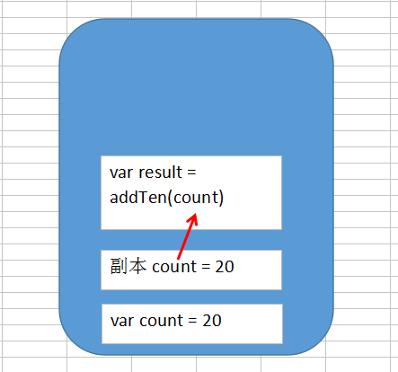
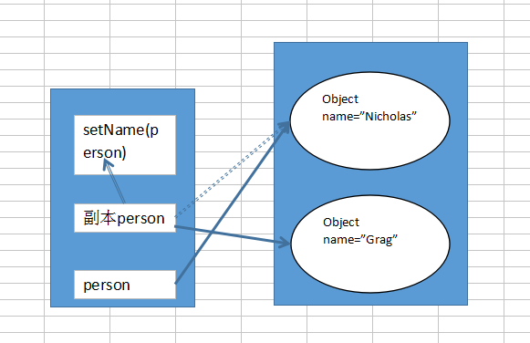

# 基本类型和引用类型

## 参数传递

> 基本类型和引用类型作为参数传递本质上都是传递参数变量的副本（引用类型变量的副本指向原变量的实例）。

``` javascript
function addTen(num){
    num += 10;
    return num;
}
var count = 20;
var result = addTen(count);
console.log(count); //20
console.log(result); //30
```



``` javascript
function setName(obj){
    obj.name = "Nicholas";
    obj = new Object();
    obj.name = "Grag";
}
var person = new Object();
setName(person);
console.log(person.name); //"Nicholas"
```



## 检测类型

### typeof 

**typeof** 用于检测基本类型

### instanceof

*result = variable instanceof constuctor*

**instance** 用于引用类型具体是什么类型的对象

``` javascript
alert(person instanceof Object); //变量person是Object吗？
```