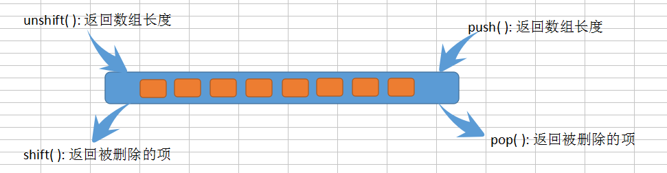

# Array

## 检测数组

* value instanceof Array
* Array.isArray(value)

## push()、pop()、shift()、unshift()



## 排序

### reverse()

``` javascript
var arr = [1,2,3,4,5];
arr.reverse();
console.log(arr); //[5,4,3,2,1]
```

### sort()

**sort()** 方法按升序排列数组项。为了实现排序，**sort()** 方法会调用每个数组项的 **toString()** 方法，然后比较得到的字符串，以确定如何排序。即使数组中的每一项都是数字值，**sort()** 比较的也是字符串。

``` javascript
var arr = [0,1,5,10,15];
arr.sort();
console.log(arr); //[0,1,10,15,5]
```

**sort()** 方法可以接收一个比较函数作为参数，以便指定比较的规则。

``` javascript
function compare(value1, value2){
    if(value1 < value2){
        return -1;
    }else if(value1 > value2){
        return 1;
    }else{
        return 0;
    }
}

var arr = [0,1,5,10,15];
arr.sort(compare);
console.log(arr); //[0,1,5,10,15]
```

## 操作方法

### concat()

``` javascript
var colors = ['red','green','blue'];
var colors2 = colors.concat("yellow",["black","brown"]);
console.log(colors); //["red", "green", "blue"]
console.log(colors2); //["red", "green", "blue", "yellow", "black", "brown"]
```

### slice()

``` javascript
var colors = ["red","green","blue","yellow","purple"];
var colors2 = colors.slice(1);
var colors3 = colors.slice(1,4);
console.log(colors); //["red", "green", "blue", "yellow", "purple"]
console.log(colors2); //["green", "blue", "yellow", "purple"]
console.log(colors3); //["green", "blue", "yellow"]
```

> *如果slice()方法的参数中有一个负数，则用数组长度加上该数来确定相应的位置。如果结束位置小于起始位置，则返回空数组。*

### splice()

**splice()** 的主要用途是向数组内部插入项，但使用这种方法的方式则有如下3中：

* **删除：** 可以删除任意数量的项，只需要指定2个参数：要删除的第一项位置和要删除的项数。如：splice(0,2) 会删除数组的前两项；
* **插入：** 可以向指定位置插入任意数量的项，只需要提供3个参数：起始位置、0（要删除的项数）和要插入的项。如果要插入多项，可以再传入第四、第五，以至任意多个项。如：splice(2,0,"red","green")会从当前数组的位置2开始插入字符串"red"和"green"；
* **替换：** 可以向指定位置插入任意数量的项，且同时删除任意数量的项，只需要指定3个参数：起始位置、要删除的项数和要插入的任意数量的项。插入的项数不必与删除的项数相等。如：splice(2,1,"red","green")会删除当前数组位置2的项，然后再从位置2开始插入字符串"red","green"。

splice() 方法始终会返回一个数组，该数组中包含从原数组中删除的项（如果没有删除任何项，则返回一个空数组）。

``` javascript
var colors = ["red","green","blue"];
var removed = colors.splice(0,1); 
console.log(colors); //["green","blue"]
console.log(removed); //["red"]

removed = colors.splice(1, 0, "yellow", "orange");
console.log(colors); //["green","yellow","orange","blue"]
console.log(removed); //[]

removed = colors.splice(1, 1, "red", "purple");
console.log(colors); //["green","red","purple","orange","blue"]
console.log(removed); //["yellow"]
```

## 位置方法 indexOf()、 lastIndexOf()

``` javascript
var numbers = [1, 2, 3, 4, 5, 4, 3, 2, 1];
console.log(numbers.indexOf(4)); //3
console.log(numbers.lastIndexOf(4)); //5

console.log(numbers.indexOf(4, 4)); //5
console.log(numbers.lastIndexOf(4, 4)); //3

var person = {name: "Nicholas"};
var people = [{name: "Nicholas"}];

var morePeople = [person];

//要求查找的项必须要严格相等（===）
console.log(people.indexOf(person)); //-1
console.log(morePeople.indexOf(person)); //0
```

## 迭代

### every()

对数组中的每一项运行给定函数，如果该函数对每一项都返回true，则返回true。

``` javascript
var numbers = [1, 2, 3, 4, 5, 4, 3, 2, 1];
var everyResult = numbers.every(function(item, index, array){
    return item > 2;
});
console.log(everyResult); //false
```

### some()

对数组中的每一项执行给定函数，如果该函数对任一项返回true，则返回true。

``` javascript
var numbers = [1, 2, 3, 4, 5, 4, 3, 2, 1];
var someResult = numbers.some(function(item, index, array){
    return item > 2;
});
console.log(someResult); //true
```

### filter()

对数组中的每一项运行给定函数，返回该函数会返回true的项组成的数组。

``` javascript
var numbers = [1, 2, 3, 4, 5, 4, 3, 2, 1];
var filterResult = numbers.filter(function(item, index, array){
    return item > 2;
});
console.log(filterResult); //[3, 4, 5, 4, 3]
```

### forEach()

对数组中的每一项运行给定函数。这个方法没有返回值。

``` javascript
var numbers = [1, 2, 3, 4, 5, 4, 3, 2, 1];
numbers.forEach(function(item, index, array){
    item++;
});
console.log(numbers); //[1, 2, 3, 4, 5, 4, 3, 2, 1]
numbers.forEach(function(item, index, array){
    array[index]++;
});
console.log(numbers); //[2, 3, 4, 5, 6, 5, 4, 3, 2]
```

### map()

对数组中的每一项运行给定函数，返回每次函数调用的结果组成数组。

``` javascript
var numbers = [1, 2, 3, 4, 5, 4, 3, 2, 1];
var mapResult = numbers.map(function(item, index, array){
    return item * 2;
});
console.log(mapResult); //[2, 4, 6, 8, 10, 8, 6, 4, 2]
```

## 缩小 reduce()、reduceRight()

``` javascript
var values = [1, 2, 3, 4, 5];
var sum = values.reduce(function(prev, cur, index, array){
    // 第一次：prev = 1, cur = 2
    // 第二次: prev = 3 (1+2); cur = 3
    // ...
    return prev + cur;
});
console.log(sum); //15

sum = values.reduceRight(function(prev, cur, index, array){
    // 第一次：prev = 5, cur = 4
    // 第二次: prev = 9 (5+4), cur = 3
    // ...
    return prev + cur;
});
console.log(sum); //15
```

